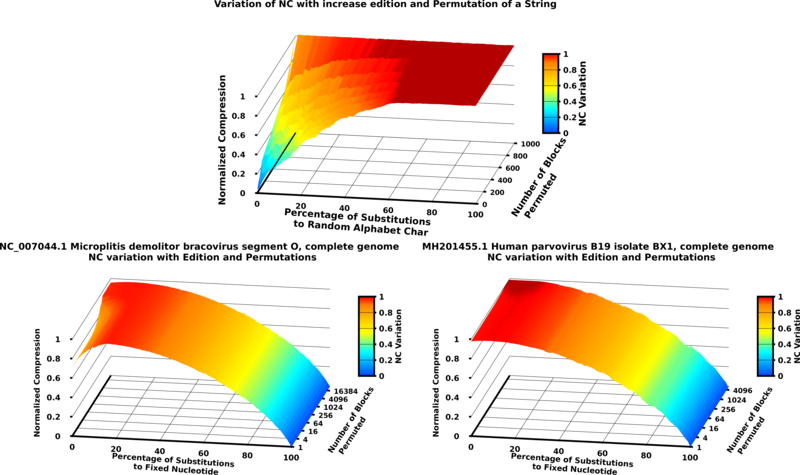
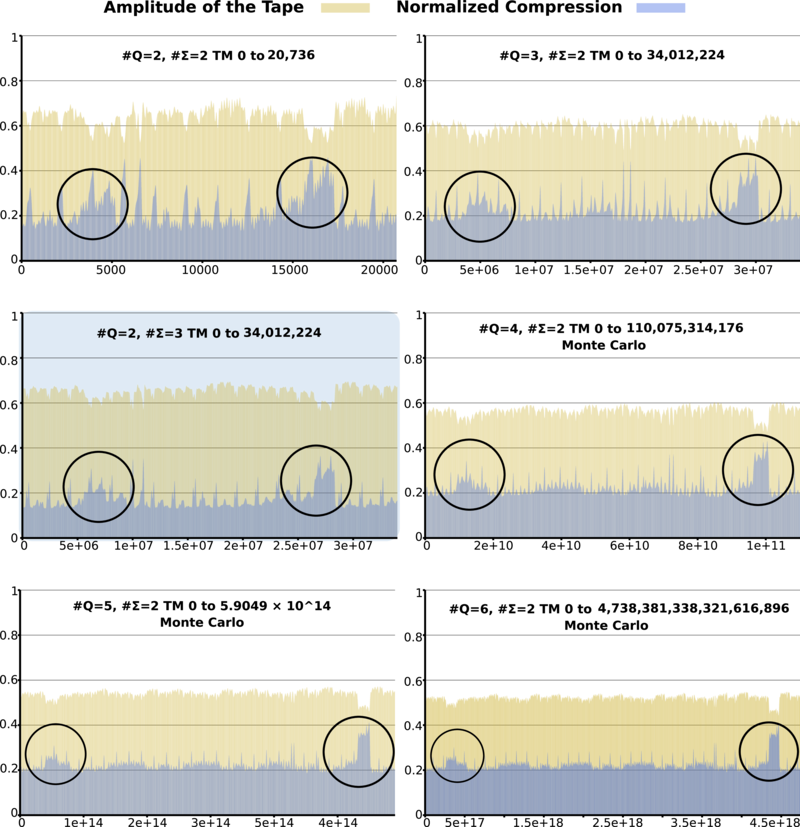
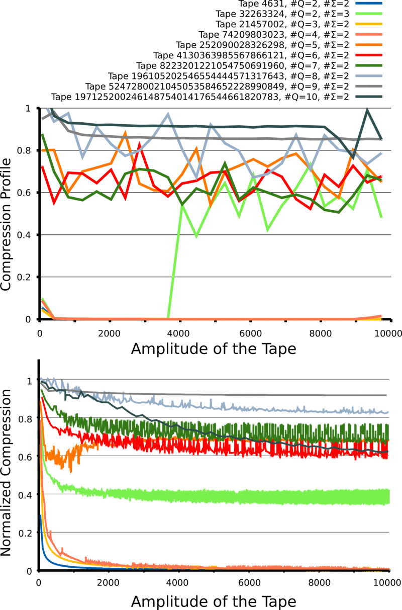
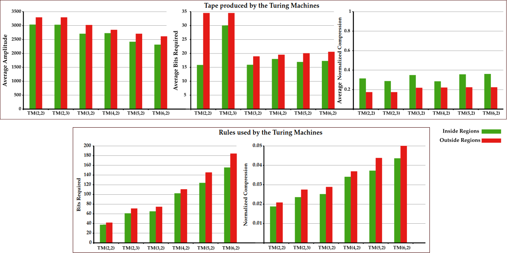
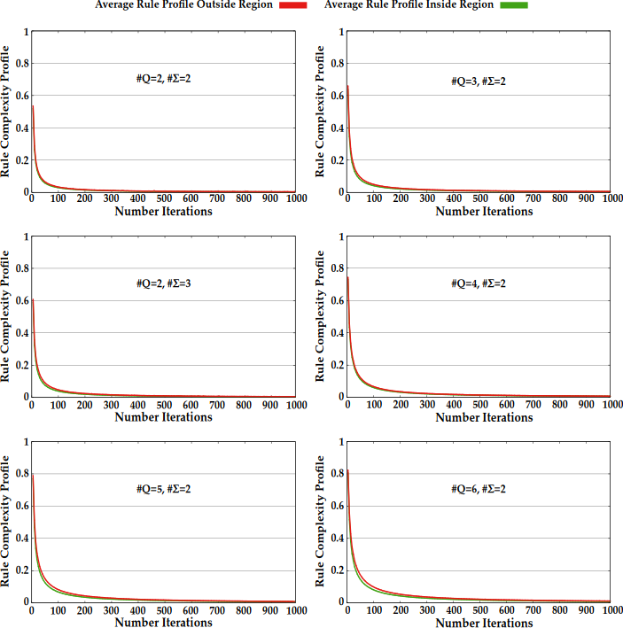
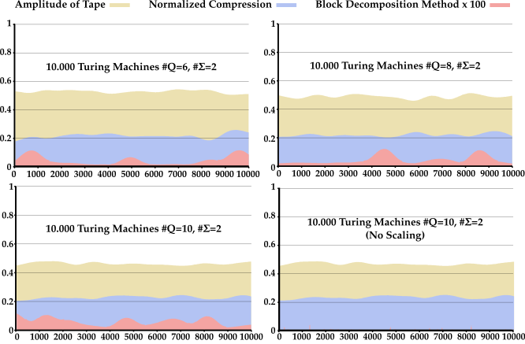
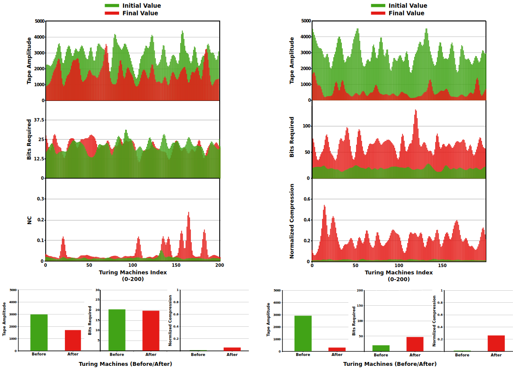
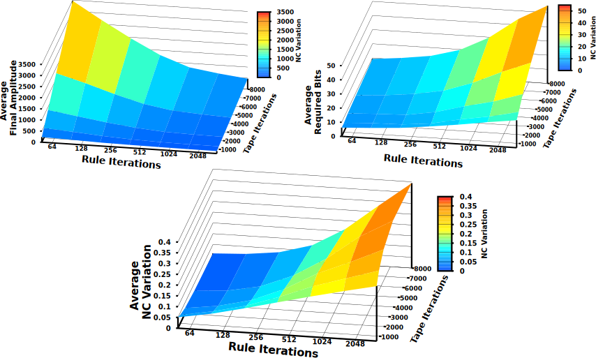

<p align="center">
</p>
<br>
<p align="center">
</p>

# Simple Turing Machines, Statistic Complexity vs Algorithmic Complexity
[](https://app.codacy.com/app/jorgeMFS/TMCompression?utm_source=github.com&utm_medium=referral&utm_content=jorgeMFS/TMCompression&utm_campaign=Badge_Grade_Dashboard)
[](https://travis-ci.org/asilab/TMCompression)
[](LICENSE)

## INSTALL
Get TMCompression and make the project, using:
```bash
git clone https://github.com/jorgeMFS/TMCompression.git;
cd TMCompression;
make;
make ioStNormalize;
make ioAverage2;
make ioGrowthAverage;
make bdmAvg;
make TMsimulator;
```
    
## TMCompression Repository Organization
Folder organization:
```Array.<string>
 ./src : Source Code of the TMCompression Program;
 ./val : Source Code of program used in Turing Tape Validation;
 ./scripts : Bash Scripts to Process Results and plot them
 ./resultText : Textual results obtained from the usage of TMCompression;
 ./resultPlots : Plots of some results obtained;
 ./profiles : Normal Profiles and Dynamic Temporal Profiles of Turing Machine Tapes.
```

## RUN TMCompression
There are many ways to run this program see help for clarification :

```bash
./tm --help;

#-----------------------------------------------------------------------------
#Program that creates Turing machines and Measures its Statistical Complexity.
#-----------------------------------------------------------------------------

#Arguments to set flags:

--verbose       #Indicates programs that will receive inputs in a verbose form.

--brief         #Indicates programs that will receive inputs in a brief form.

--tmverbose     #Indicates programs that tm output will be send to the user.

--tmgrowth      #Indicates programs that output a list of Turing machines with an increase in the number of states and a alphabet size of 2

--replicate     #Indicates programs that will replicate experiment to determine the best k and it for a given number of states and alphabet size.

--profile       #Indicates programs that will receive through the tm number through the flag tm and will create a profile of that turing

--dynprofile    #Indicates programs that will receive through the tm number through the flag tm and will create a dynamical temporal profile of that turing

--ruleProfile   #Indicates programs to create a Compression profile of the rules for a given Turing Machine

--ruleMetrics   #Indicates programs to compute the rule metrics of a given TMs

--StMatrix      #Indicates programs to print the StateMatrix of a given TMs

--mutate        #Indicates programs to print the nc of the mutation of a string (starting with all zeros and ending with all ones) and performing mutations until its 100% mutated

--mutateVirus   #Indicates programs perform the edition and permutation of a virus DNA sequence and print NC results

--MethodI       #Indicates programs to recreate similar list of results used in plots of the article using MethodI

--MethodII      #Indicates programs to recreate similar list of results used in plots of the article using MethodII

--3DgraphMethodII       #Indicates programs to recreate similar list of results used in 3D plots of the article using MethodII

#Mandatory  Arguments:

-s, --number_states     #Number of States the Turing Machine has.

-a, --alphabet_size     #Alphabet size the Turing Machine considers.

-i, --iterations         #Number of iterations the Turing Machine makes in the tape.

-k, --context   #k indexes to consider as a context to fill the Markov Table.

-t, --tm        #Speciffy turing to obtain results, can only be activated with --profile flag.

#Other Optional Arguments:

-S, --strategy  #Turing Machine traversal strategy (default: sequential)

-N,     #Number of Turing Machines to traverse

-v, --version   #Outputs the version of the program.

-h, --help      #Describes program.

#-----------------------------------------------------------------------------
#Examples:
#-----------------------------------------------------------------------------
#Run all tms
./tm -s 2 -a 2 -i 10 -k 1 
./tm --brief -s 2 -a 2 -i 10 -k 1
./tm --verbose --number_states=2 --alphabet_size=2 --iterations=20 --context=2
#----------------
#Run all tms with multithreads
./tm -s 2 -a 2 -i 10 -k 1 -j 7
./tm --brief -s 2 -a 2 -i 10 -k 1 -j 7
#----------------
#Strategies of running TM Machines
#By default strategy is Sequential:
./tm --brief -s 2 -a 2 -i 10 -k 1 -j 7
./tm --brief -s 2 -a 2 -i 10 -k 1 -N 10 -j 4 -S sequential
#Monte Carlo:
./tm --brief -s 2 -a 2 -i 10 -k 1 -N 10 -j 4 -S monte_carlo
#----------------
#Run specific TM and obtain profile:
./tm --brief --profile -s 2 -a 2 -i 100 -k 2 -t 5
#----------------
#Run a specific TM and obtain their rules normal complexity profile
./tm --brief --ruleProfile -s 2 -a 2 -i 100 -k 2 -t 5
#----------------
#Run specific tm and obtain dynamical temporal profile:
./tm --brief --dynprofile -s 2 -a 2 -i 100 -k 2 -t 5 
#----------------
# Run specific tm and obtain their Rule Compression Profile:
#----------------
./tm --brief --ruleMetrics -s 2 -a 2 -i 100 -t 5
# ----------------
#Replicate k and it determination:
./tm --brief --replicate -s 2 -a 2 -j 10
#----------------
#turing machine growth with alphabet size of 2 and increase in state cardinality:
./tm --tmgrowth
#----------------
#Run specific tm and print tape
./tm --brief --printTape -s 2 -a 2 -i 100 -t 1
#----------------
#Run StMatrix of the tm
./tm --brief --StMatrix -s 2 -a 2 -t 1
#----------------
#Obtain nc of the substitutions and permutations of a string 
./tm --mutate
#----------------
#Obtain nc of Virus genome sequence with substitutions and permutations
echo "./resultText/Parvovirus_virus_genome.txt" | ./tm --mutateVirus
#----------------
#Obtain list of graph of Method I
./tm --MethodI
#----------------
#Obtain list of graph of Method II
./tm --MethodII
#----------------
#Obtain list of 3d graphs of Method II
./tm --3DgraphMethodII
#----------------
```

## RECREATE PLOTS IN ARTICLE
To recreate the plots shown in the article (bellow example):

```bash
chmod +x run.sh;
bash run.sh;
```
<b>Virus and String edition and Permutation Plots:</b>
<p align="center">
</p>
<br>
<p align="center">
</p>

```bash
# Command to create list:
echo "./resultText/Parvovirus_virus_genome.txt" | ./tm --mutateVirus;
# Recreate Edition and permutation plots...";
bash reprArticlePlot.sh 0 0 1 1 1 1;
```

<b>TMs Plots:</b>
<p align="center">
</p>
<br>
<p align="center">
</p>

```bash
# Recreating plots of Cardinality Growth and TMs...;
bash processResults.sh 0 1 1 1 1 1 1 1;
```

<b>Profile Plots:</b>
<p align="center">
</p>
<br>
<p align="center">
</p>

```bash
# Recreate Plots of Normal and Dynamic Profiles...";
bash reprArticlePlot.sh 1 1 0 0 0 0;
```
<b>Inside and outside Region Plots:</b>
<p align="center">
</p>
<br>
<p align="center">
</p>

```bash
# Recreating Plot of Inside vs Outside region of TM Tapes...;
bash getRegionTapeValues.sh;
# Recreating Plot of Inside vs Outside region of TM Rules...
bash getRegionRuleValues.sh 1 0 1 1;
```
<b>Average Rule Complexity Profiles plots:</b>
<p align="center">
</p>
<br>
<p align="center">
</p>

```bash
# Obtain Average Rule Profiles...
bash avg_rule_profile.sh 1 1;
```
<b>Block Decomposition Method comparation with NC plots:</b>
<p align="center">
</p>
<br>
<p align="center">
</p>

```bash
#Compare BDM with NC for #Q={6,8,10}...
bash bdm_NC_comparisson.sh 1 0 1 1;
```

<b>Method I and II plots:</b>
<p align="center">
</p>
<br>
<p align="center">
</p>

```bash
# Command to create list:
./tm  --MethodI;
./tm  --MethodII;
# Recreate Plots of Method I and II.
bash evolve_tm_plot.sh Method_I_200;
bash evolve_tm_plot.sh Method_II_2000;
```
<b>3D Method II Plots:</b>
<p align="center">
</p>
<br>
<p align="center">
</p>

```bash
# Command to create list:
./tm  --3DgraphMethodII;
# Recreate 3D Plot of Method II...
bash 3d_evolve_graph.sh;
```

Note: This downloads the files Containing the results from running all TMs for a given State and Alphabet Cardinality, since this can take from several minutes to several days. If you wish to recreate the Results use TM program. Example:

```bash
./tm --brief -s 2 -a 4 -i 50000 -k 2:10 -N 30000000 -j 20 -S monte_carlo > 2sts4alp.txt;
```

## RUN OTHER SCRIPTS
There are two main scripts:
```bash
./processResults.sh : "Plots graphics shown in Folder ./resultPlot"
./filteringResults.sh :"Plots Profiles shown in Folder ./profiles"
```

There are many ways to the scripts, see help for clarification:

```bash
bash scripts/processResults.sh;
bash scripts/filteringResults.sh;
```

## CITE
Please cite the followings, if you use TMCompression:

```Array.<string>
- Processing...
```
## ISSUES
Please let us know if there is any
[issues](https://github.com/jorgeMFS/TMCompression/issues).

## LICENSE
TMCompression is under GPL v3 license. For more information, click
[here](http://www.gnu.org/licenses/gpl-3.0.html).
